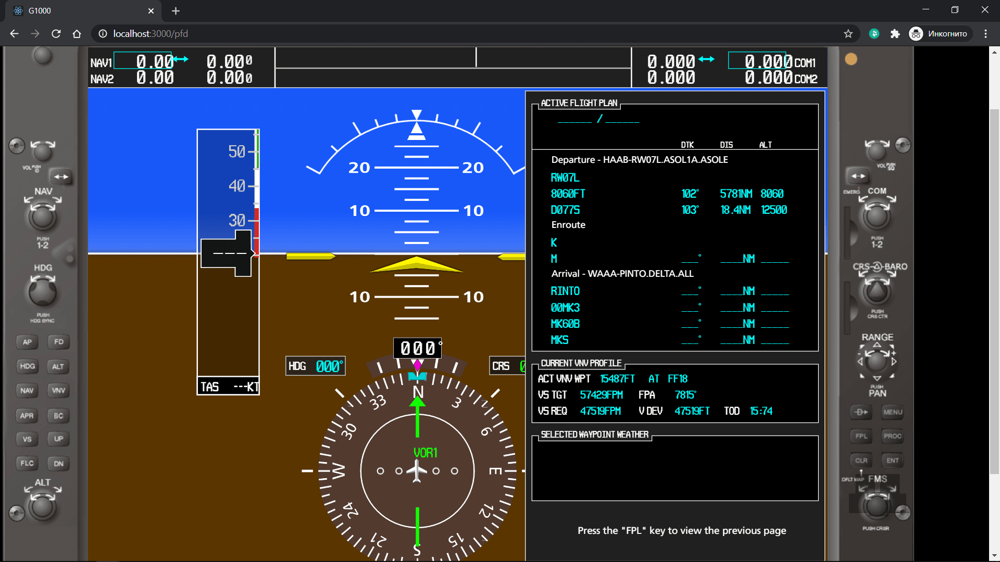

# G1000 (menu)

> This project doesn't have deployed version. You can only see code [here](./code-example) (Active Flight Plan window example from MFD mode).

> First part of the project you can see [here](https://github.com/tppd67421/G1000-PFD).

> Project description is divided into two parts:
> - [PFD mode](./pfd/README.md);
> - [MFD mode](./mfd/README.md).

## Technologies used

- React;
- React Konva (for canvas).

## Project description

This project represents flight instrument [G1000](https://en.wikipedia.org/wiki/Garmin_G1000), which connected with [X-Plane application](https://www.x-plane.com/). Purporse of work was creating menu windows for application. A total of 26 menu windows were created. 8 of them are interactive. Application has two modes (PFD and MFD) and four windows group in each mode:

- Direct To;
- Menu;
- Flight To Plan;
- Procedures.

[Menu windows from PFD mode](./pfd/README.md)

[Menu windows from MFD mode](./mfd/README.md)
