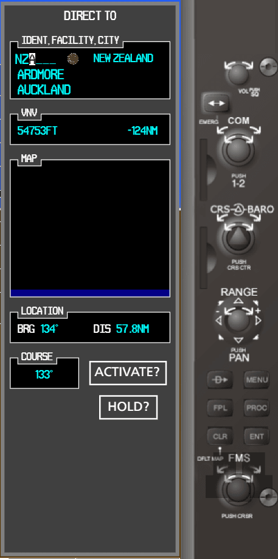

## Windows from MFD mode:

#### 1. [Direct To](#Direct-To) (interactive)


#### 2. [Menu](#Menu)


#### 3. [Flight Plan](#Flight-Plan) (interactive)


#### 4. [Procedures](#Procedures)


So, in MFD mode we have next windows:
- Direct To (interactive);
- Menu;
- Flight Plan:
    - WPT:
        - AirportInformation;
        - IntersectionInformation;
        - NdbInformation;
        - VorInformation;
        - UserWptInformation.
    - FPL:
        - ActiveFlightPlan:
            - ActiveFlightPlan (interactive);
            - WaypointInformation (interactive).
        - FlightPlanCatalog:
            - FlightPlanCatalog;
            - StoredFlightPlan;
            - WaypointInformation (interactive).
    - NRST:
        - NearestAirports;
        - NearestIntersections;
        - NearestNdb;
        - NearestVor;
        - NearestUserWpts;
        - NearestFrequencies;
        - NearestAirspaces.
- Procedures:
    - Select Approach;
    - Select Arrival.

In this mode we have 20 windows, 3 of them are interactive.

<hr>

## Direct To

This window have same logic like a Direct To from MFD mode. Only three  fields from sub window _IDENT, FACILITY, CITY_ have interactivity.

Direct To window:


Active Direct To window:



Animated Direct To window:


<hr>

## Menu

Now this menu doesn't have interactivity and do nothibg. This menu only render React state. React state example:

Menu window:


```js
{
    title: 'Cancel Direct-To NAV',
    available: false,
    active: false,
}, {
    title: 'Clear Vertical Constraints',
    available: false,
    active: false,
}, {
    title: 'Edit Hold',
    available: false,
    active: false,
}, {
    title: 'Hold At Present Position',
    available: true,
    active: true,
}
```

<hr>

## Procedures

This window have three children window (but was do only two, because they was same). Nothing from this windows don't have interactivity.

This windows will have more informacion, because here should be scroll. Now you can set in the React state the number of lines by which you need to scroll the information in the sub window.

Also in this windows will show modal windows.

Procedures window:


Procedures Select Approach window:


Procedures Select Arrival window:


<hr>

## Flight Plan

Flight Plan menu will description in the last one, because thim menu have the most difficult logic and the most menu windows.

User can switch between Flight Plan windows. Example on the gif below:


Flight Plan have 14 menu windows. More windows have scroll looks like procedures windows.

#### Menu windows from WPT:

Airport Information:


Intersection Information:


Ndb Information:


Vor Information:


User Wpt Information:


#### Menu windows from FPL:

Active Flight Plan:


Flight Plan Catalog:


#### Menu windows from NRST:

Nearest Airports:


Nearest Intersections:


Nearest Ndb:


Nearest Vor:

_Like a Nearest Ndb_

Nearest User Wpts:


Nearest Frequencies:


Nearest Airspaces:


Only windows from FPL have logic and interactive. Write about this more.

#### Active Flight Plan:

> You can see code of this window [here](./code-example).

This is the most difficult window from all project. Empty window looks like this:


User can add some information to this window:


And this window will looks like this:


User can also add grouped information from [Procedures](#Procedures) window (now we don't have this functionality, but in future will implement). If user will add some information, window Active Flight Plan will looks like this:


In code all data save in React state and arrays. You can write any data in any group and alghoritm will calculate coordinates X and Y for drawing text. If any group will missing, this group will don't show with title. Few examples:

<details>
    <summary>Window example:</summary>

```js
const arrivalData = [
    {
        text: 'Arrival - WAAA-PINTO.DELTA.ALL'
    },
    {
        text: ['RINTO'],
        dtk: dtkDefaultStr,
        dis: disDefaultStr,
        alt: altDefaultStr
    },
    {
        text: ['00MK3'],
        dtk: dtkDefaultStr,
        dis: disDefaultStr,
        alt: altDefaultStr
    },
    {
        text: ['MK60B'],
        dtk: dtkDefaultStr,
        dis: disDefaultStr,
        alt: altDefaultStr
    },
    {
        text: ['MKS'],
        dtk: dtkDefaultStr,
        dis: disDefaultStr,
        alt: altDefaultStr
    },
]

const approachData = [
    {
        text: 'VTF Apr - ME49-GPS 198° LNAV'
    },
    {
        text: ['HAXUS'],
        dtk: '',
        dis: '',
        alt: ''
    },
    {
        text: ['HASMO', 'faf'],
        dtk: 198,
        dis: '2.7',
        alt: 2600
    },
    {
        text: ['WUBIM', 'map'],
        dtk: 198,
        dis: '2.0',
        alt: ''
    },
    {
        text: ['1500FT'],
        dtk: 198,
        dis: '0.5',
        alt: 1500
    },
    {
        text: ['ZUBAR', 'mahp'],
        dtk: '',
        dis: '',
        alt: 4600
    },
    {
        text: ['HOLD'],
        dtk: 198,
        dis: '4.0',
        alt: ''
    },
]

const departureData = [
    {
        text: 'Departure - HAAB-RW07L.ASOL1A.ASOLE'
    },
    {
        text: ['RW07L'],
        dtk: '',
        dis: '',
        alt: ''
    },
    {
        text: ['8060FT'],
        dtk: 102,
        dis: '5781',
        alt: 8060
    },
    {
        text: ['D077S'],
        dtk: 103,
        dis: '18.4',
        alt: '12500'
    },
]

const [dataStore, setDataStore] = useState([
    {
        text: getDefaultTitleValue(),
        active: true,
        width: 200,
        coordinates: { x: 10, y: 0 }
    },
    {
        text: ['K'],
        dtk: '',
        dis: '',
        alt: ''
    },
    {
        text: ['M'],
        dtk: dtkDefaultStr,
        dis: disDefaultStr,
        alt: altDefaultStr
    },
    {
        text: [defaultAirportValue],
        active: false,
        width: 110
    },
])
```


    
</details>


<details>
    <summary>Window example:</summary>

```js
const arrivalData = [ ]

const approachData = [
    {
        text: 'VTF Apr - ME49-GPS 198° LNAV'
    },
    {
        text: ['HAXUS'],
        dtk: '',
        dis: '',
        alt: ''
    },
    {
        text: ['HASMO', 'faf'],
        dtk: 198,
        dis: '2.7',
        alt: 2600
    },
    {
        text: ['WUBIM', 'map'],
        dtk: 198,
        dis: '2.0',
        alt: ''
    },
    {
        text: ['1500FT'],
        dtk: 198,
        dis: '0.5',
        alt: 1500
    },
    {
        text: ['ZUBAR', 'mahp'],
        dtk: '',
        dis: '',
        alt: 4600
    },
    {
        text: ['HOLD'],
        dtk: 198,
        dis: '4.0',
        alt: ''
    },
]

const departureData = [
    {
        text: 'Departure - HAAB-RW07L.ASOL1A.ASOLE'
    },
    {
        text: ['RW07L'],
        dtk: '',
        dis: '',
        alt: ''
    },
    {
        text: ['8060FT'],
        dtk: 102,
        dis: '5781',
        alt: 8060
    },
    {
        text: ['D077S'],
        dtk: 103,
        dis: '18.4',
        alt: '12500'
    },
]

const [dataStore, setDataStore] = useState([
    {
        text: getDefaultTitleValue(),
        active: true,
        width: 200,
        coordinates: { x: 10, y: 0 }
    },
    {
        text: ['K'],
        dtk: '',
        dis: '',
        alt: ''
    },
    {
        text: ['M'],
        dtk: dtkDefaultStr,
        dis: disDefaultStr,
        alt: altDefaultStr
    },
    {
        text: [defaultAirportValue],
        active: false,
        width: 110
    },
])
```


</details>


<details>
    <summary>Window example:</summary>

```js
const arrivalData = []

const approachData = [ ]

const departureData = [
    {
        text: 'Departure - HAAB-RW07L.ASOL1A.ASOLE'
    },
    {
        text: ['RW07L'],
        dtk: '',
        dis: '',
        alt: ''
    },
    {
        text: ['8060FT'],
        dtk: 102,
        dis: '5781',
        alt: 8060
    },
    {
        text: ['D077S'],
        dtk: 103,
        dis: '18.4',
        alt: '12500'
    },
]

const [dataStore, setDataStore] = useState([
    {
        text: getDefaultTitleValue(),
        active: true,
        width: 200,
        coordinates: { x: 10, y: 0 }
    },
    {
        text: ['K'],
        dtk: '',
        dis: '',
        alt: ''
    },
    {
        text: ['M'],
        dtk: dtkDefaultStr,
        dis: disDefaultStr,
        alt: altDefaultStr
    },
    {
        text: [defaultAirportValue],
        active: false,
        width: 110
    },
])
```


</details>


<details>
    <summary>Window example:</summary>

```js
const arrivalData = []

const approachData = [ ]

const departureData = [ ]

const [dataStore, setDataStore] = useState([
    {
        text: getDefaultTitleValue(),
        active: true,
        width: 200,
        coordinates: { x: 10, y: 0 }
    },
    {
        text: ['K'],
        dtk: '',
        dis: '',
        alt: ''
    },
    {
        text: ['M'],
        dtk: dtkDefaultStr,
        dis: disDefaultStr,
        alt: altDefaultStr
    },
    {
        text: [defaultAirportValue],
        active: false,
        width: 110
    },
])
```


</details>


#### Flight Plan Catalog:

In this window user can set and see catalog with flight plan. 


Each line looks like as Active Flight Plan. This window have same logic. User select line and set in this line flight plan like as in Active Flight Plan. After select line show next window:


If user want add point to Stored Flight Plan, he will see Waypoint Window:


After added point this item will add to Stored Flight Plan. After fill Stored Flight Plan he will show in Flight Plan Catalog.

<hr>

[Back](https://github.com/tppd67421/G1000-menu)

[Prev - PFD mode](./../pfd/README.md)
