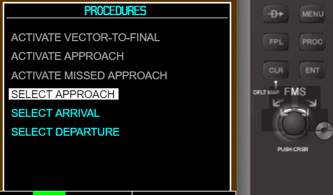

## Windows from PFD mode:

#### 1. [Direct To](#Direct-To) (interactive)


#### 2. [Menu](#Menu) (interactive)


#### 3. [Flight Plan](#Flight-Plan) (interactive)


#### 4. [Procedures](#Procedures) (interactive)



So, in PFD mode we have next windows:
- Direct To:
    - Direct To (interactive);
    - Duplicate Waypoints.
- Menu (interactive);
- Flight Plan:
    - Flight Plan (interactive);
    - Waypoint Information (interactive);
    - Duplicate Waypoints.
- Procedures (interactive).

In this mode we have 6 windows, 5 of them are interactive (we can count _Duplicate Waypoints_ how one window, because this just one component with differents data).

<hr>

## Direct To

In this window user set airport point. User can find airport by airport ID, airport name or airport city. Of course, we can have duplicates. If we have duplicates we going to next window with all duplicates. Now this window show selected airport ID and country list. After update this window will be show more info. In current time all airports data taked from js array.

Active Direct To window:


Active Duplicate Waypoints window:


Animated Direct To window:


<hr>

## Menu

Right now this menu do nothing. This window interactive and later will be connected with application.


<hr>

## Flight Plan

This window like a _Direct To_. But have difference. Here we can set waypoints list. In first line we can set custom name. Otherwise algorithm set first and last waypoints. If we have duplicates we also going to _Duplicate Waypoints_ window. In example we work with field city, but we can work with another fields (airport ID or airport airport name).

Active Flight Plan window:


Animated Flight Plan window:


<hr>

## Procedures

This window don't have complex logic. Right now user can only switch between menu items. List with menu items save in React state. Each item have next fields:
- title;
- available;
- active (active item in current time, or no).

State example:

```js
{
    title: 'ACTIVATE MISSED APPROACH',
    available: false,
    active: false
}, {
    title: 'SELECT APPROACH',
    available: true,
    active: true
}, {
    title: 'SELECT ARRIVAL',
    available: true,
    active: false
}
```

Animation example:


<hr>

[Back](./../README.md)

[Next - MFD mode](./../mfd/README.md)
